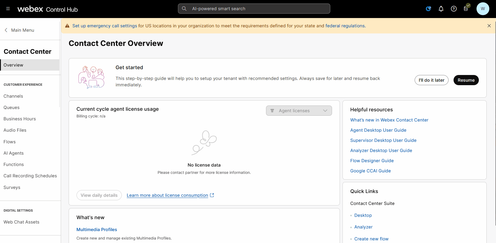
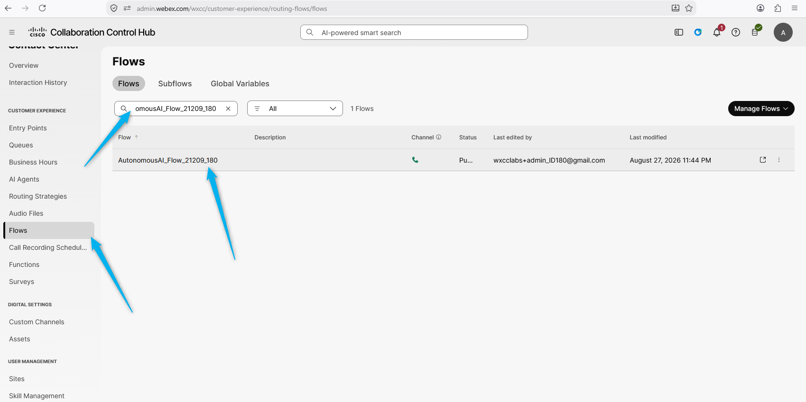
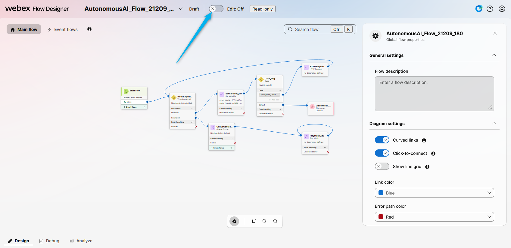

# Mission 2: Integrating the AI Agent with Flow for Voice Calls

## Mission overview

Your mission is to:

Integrate the AI Agent with the Voice Flow.

### Task 1. Build WxCC voice flow with AI Agent.

1. Open [Control Hub](https://admin.webex.com){:target="_blank"} and go to **Contact Center** navigate to **Flows**, click on **Manage Flows** dropdown list and select **Create Flows**.
   

2. One the next page select in the Search for the flow that is related to your ID **<copy>AutonomousAI_Flow_21209_<w class="attendee"></w></copy>**. Open the flow by clicking on it. 
   

3. Click on Edit to start additing the flow. 
   

4. Click on **VirtualAgentV2** node and change the Virtual Agent name to the one that is related to your ID - **<copy><w class="attendee"></w>_21209_AutoAI_Lab</copy>**.

<strong>Congratulations, you have officially completed this mission! 🎉🎉 </strong>

