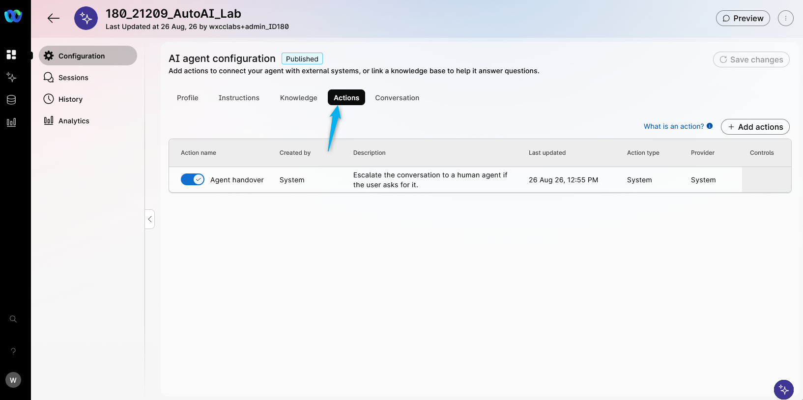
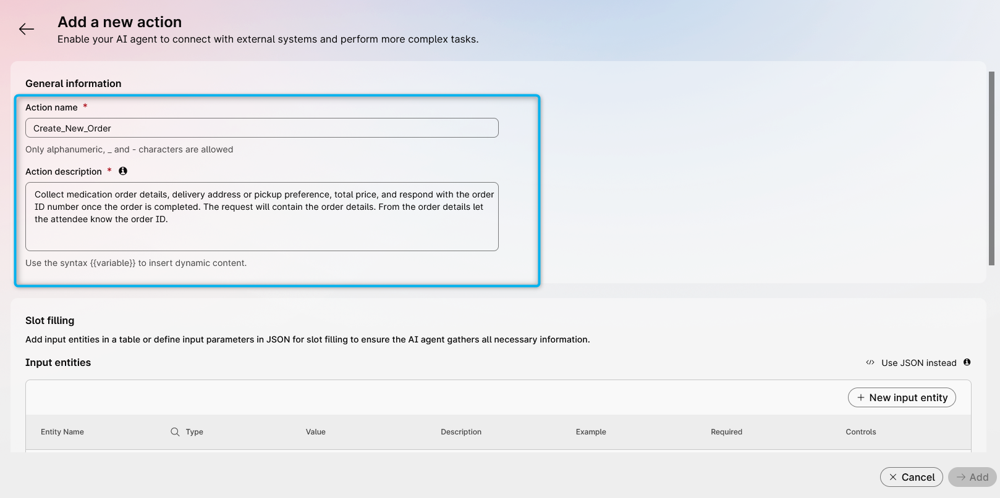
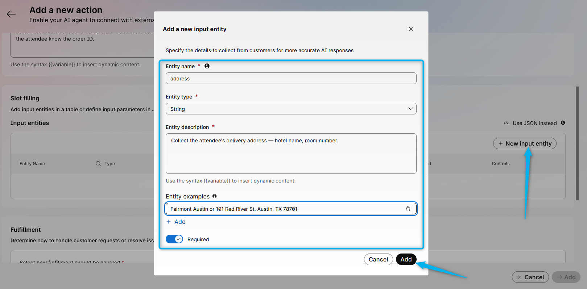
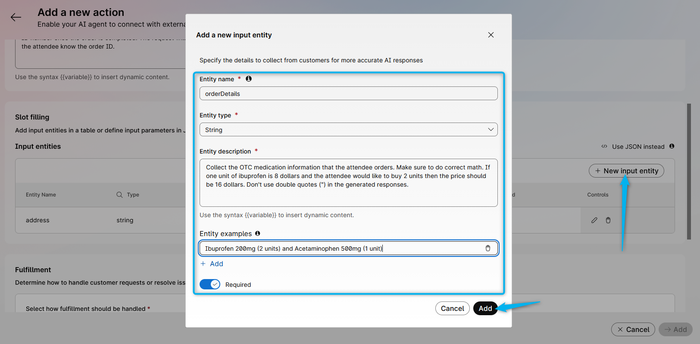
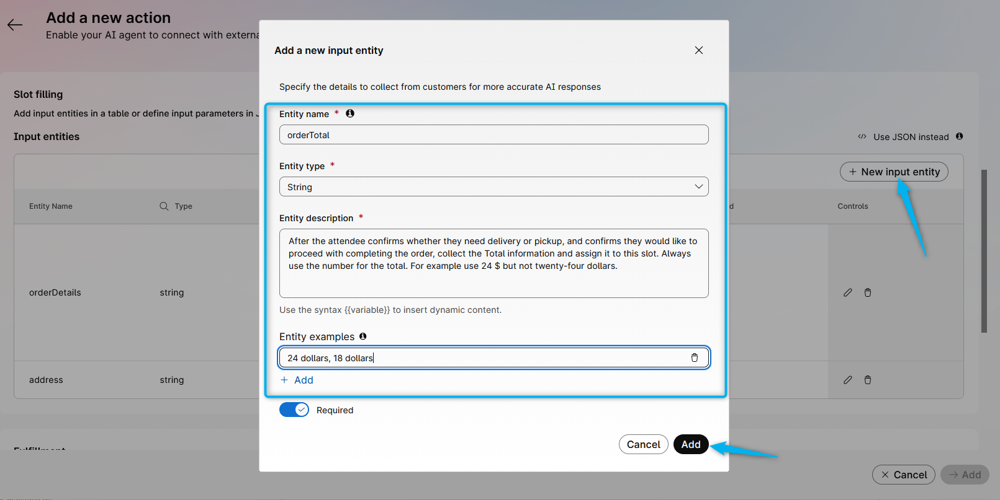
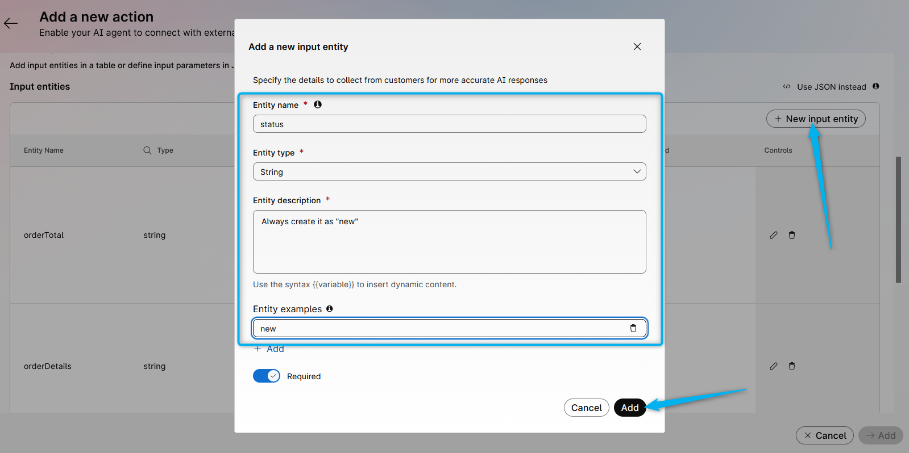
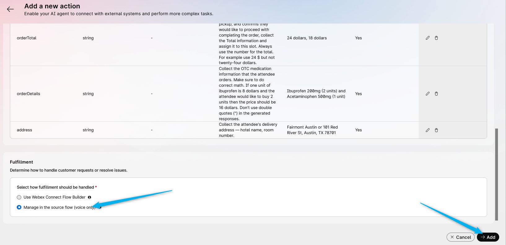
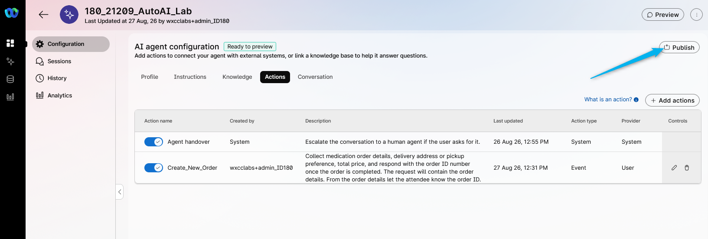
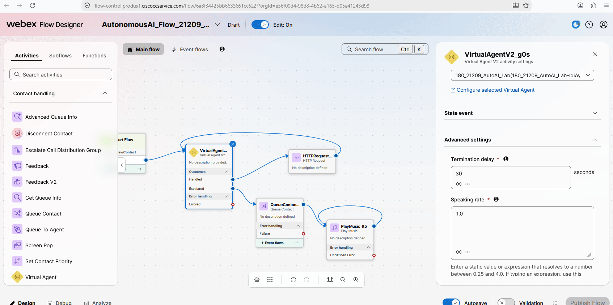

# Mission 3: Configure Fulfillment Action and create a medication order using **Voice Flow**.

**

What is a Fulfillment Action? 
**

Fulfillment Action is a task that an AI agent performs by understanding user intents and completing by connecting to external systems over an API.

## 

## Mission overview

In this Mission you will be using the Voice flow to execute the API call to create the medication order with a third party system.

---

## Build

### Task 1. Configure Action in the AI Studio

1. Go to **Webex AI Agent Studio** Portal.

2. Select your AI agent with name **<copy><w class="attendee"></w>\_21209_AutoAI_Lab</copy>** that you created earlier and go to **Actions**. You will see one Action has already been created by default for the Agent Handover. We will now create one more action.
   

3. Click **Create New Action**. From the drop-down option, select **Fulfillment**.
   

4. Configure it with name **_<copy>Create_New_Order</copy>_** and the Action description below. 
   > Action description: **_<copy>Collect medication order details, delivery address or pickup preference, total price, and respond with the order ID number once the order is completed. The request will contain the order details. From the order details let the attendee know the order ID.</copy>_**
   

5. Scroll down and click to create **New input entity**. Fill up the table with the following and then click on **Add**.  
   > Entity Name: **_<copy>address</copy>_**  
   > Entity Type: <b>string</b>  
   > Description: **_<copy>Collect the attendee's delivery address — hotel name, room number.</copy>_** 
   > Example: **_<copy>Fairmont Austin or 101 Red River St, Austin, TX 78701</copy>_**  
   > Required: <b>Yes</b>
   

6. By following the same pattern, create an entity to collect the attendee's medication order details. 
   > Entity Name: **_<copy>orderDetails</copy>_** 
   > Entity Type: <b>string</b>  
   > Description: **_<copy>Collect the OTC medication information that the attendee orders. Make sure to do correct math. If one unit of ibuprofen is 8 dollars and the attendee would like to buy 2 units then the price should be 16 dollars. Don't use double quotes (") in the generated responses.</copy>_** 
   > Example: **_<copy>Ibuprofen 200mg (2 units) and Acetaminophen 500mg (1 unit)</copy>_** 
   > Required: <b>Yes</b>
      

7. By following the same pattern, create an entity to store the total price information of the order. 
   > Entity Name: **_<copy>orderTotal</copy>_** 
   > Entity Type: <b>string</b>  
   > Description: **_<copy>After the attendee confirms whether they need delivery or pickup, and confirms they would like to proceed with completing the order, collect the Total information and assign it to this slot. Always use the number for the total. For example use 24 $ but not twenty-four dollars.</copy>_** 
   > Example: **_<copy>24 dollars, 18 dollars</copy>_** 
   > Required: <b>Yes</b>
     

8. By following the same pattern, create an entity to store the order status information. 
   > Entity Name: **_<copy>status</copy>_** 
   > Entity Type: <b>string</b>  
   > Description: **_<copy>Always create it as "new"</copy>_** 
   > Example: **_<copy>new</copy>_** 
   > Required: <b>Yes</b>
     

9. At this point you should see 4 created entities. Please double-check that your configuration matches the screenshot below.
    

10. Scroll down and for the **Fulfillment** option select **Manage in the source flow (voice only)**. Click **Save**.
   

11. **Publish** your AI Agent.
   

### Task 2. Configure fulfillment logic in the Voice flow.

1. In **Control Hub** go to Flows and open your flow with name **<copy>AutonomousAI_Flow_21209_<w class="attendee"></w></copy>**. Click on **Edit**.
   

2. Remove **DisconnectContact** node.
   

3. Add **HTTP Request** node and connect the Handled output from **VirtualAgentV2** to the **HTTP Request** node.
   

4. Configure the **HTTP Request** with the following:

    - Use authenticated endpoint: **Off**
    - Request URL: **<copy>https://6a8f2a04a12b7de8cc0f5889.mockapi.io/customerOrder</copy>**
    - Method: **POST**
    - Content type: **Application/JSON**
       

5. Configure the body of the HTTP request as the Metadata Activity output variable from the **VirtualAgentV2** node. Please see the pictures below.
   

6. For this lab we are only using one fulfillment flow. To reconnect the call back to the AI agent and continue the conversation properly, we need to configure the event name. Click on the **VirtualAgentV2** node, scroll down to the bottom and copy the Activity output variable for the event name. Then in the same **VirtualAgentV2** node, open **State event** and paste it under **Event name**. See the pictures below.
   

7. Next you need to bring the API call results back to your AI agent. For this, click on the **HTTP Request** node, scroll down on the right side and copy the name of the HTTPRequest...ResponseBody. Then go to the **VirtualAgentV2** node, open **State Events**, and insert the HTTP body response into **Event Data** inside of the {{}}. See the steps on the gif below.
   

8. Enable decryption in the flow so you can monitor details of your further test calls.
   

9. **Validate** and **Publish** the flow with the **Latest** tag.
   

10. Place a test call to your test number. Ask to order OTC medication and provide the requested information. You should hear that the order was completed successfully. If not, use **Debugger** to troubleshoot.

<strong>Congratulations, you have officially completed this mission! 🎉🎉 </strong>

