# Mission 3: Configure Fulfillment Action and create a medication order using **Voice Flow**.

**

What is fulfilment Action? 
**

Fulfillment Action is a task that an AI agent performs by understanding user intents and completes by connecting to external systems over API.

## 

## Mission overview

In this Mission you will be using the Voice flow to execute the API call to create the medication order in order to complete the AI Agent Fulfillment.

---

## Build

### Task 1. Configure Action in the AI Studio

1. Go to **Webex AI Agent AI** Studio Portal.
   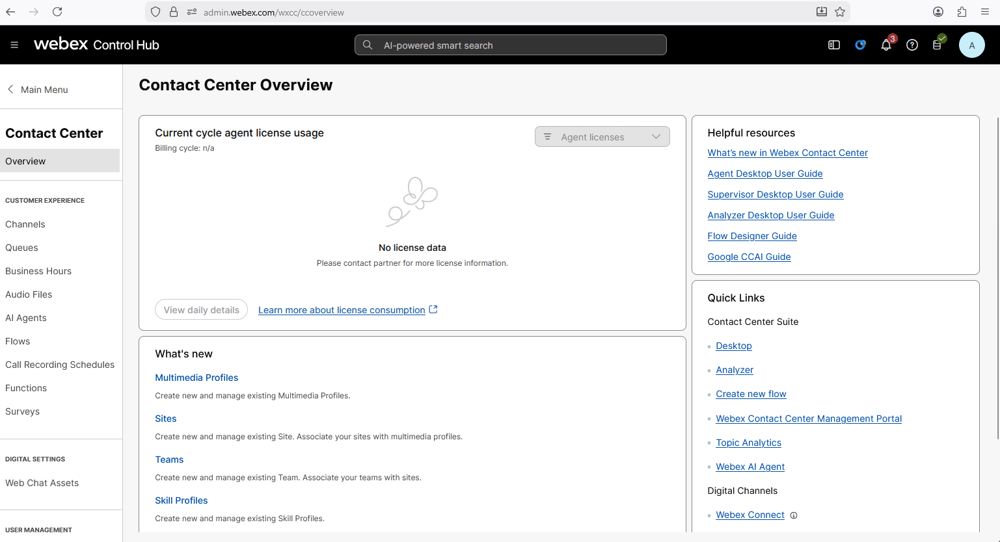

2. Select your AI agent with name **<copy><w class="attendee"></w>\_21209_AutoAI_Lab</copy>** that you created earlier and go to **Actions**. You will see one Action is already created by default for the Agent Handover. We will now create a few more actions.
   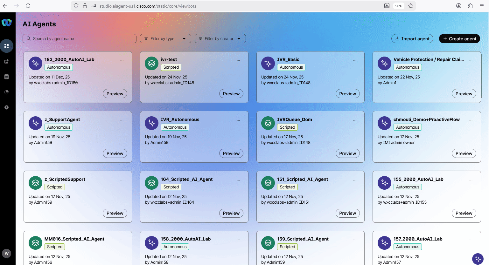

3. Click on create <b>New Action</b>. From the drop-down option, select **Fulfillment**.
   

4. Configure it with name **_<copy>Create_Medication_Order</copy>_** and the Action description **_<copy>Collect medication order details, delivery address or pickup preference, total price, and respond with the order ID number once the order is completed. The request will contain the order details. From the order details let the attendee know the order ID.</copy>_**. In the Action score select <b>Slot filling and fulfillment</b>.
   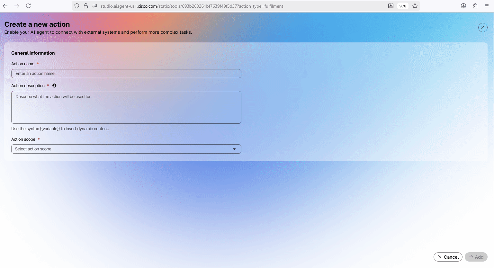

5. Scroll down and click to create **New input entity**. Fill up the table with the following and then click on **Add**.  
   > Entity Name: **_<copy>address</copy>_**  
   > Entity Type: <b>string</b>  
   > Description: **_<copy>Collect the attendee's delivery address — hotel name, room number, or pharmacy pickup location</copy>_** 
   > Example: **_<copy>Marriott Downtown, Room 412, San Diego, CA 92101</copy>_**  
   > Required: <b>Yes</b>
   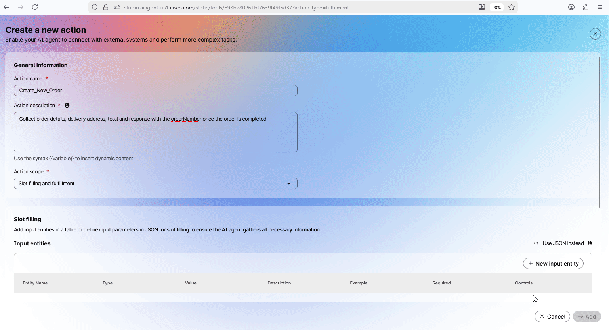

6. By following the same pattern, create an entity that specifies whether the attendee requires delivery.  
   > Entity Name: **_<copy>delivery</copy>_** 
   > Entity Type: <b>string</b>  
   > Description: **_<copy>Check if the attendee needs hotel delivery or pharmacy pickup. Even if they want to proceed with the order without specifying delivery details, ask one more time if they need delivery to their hotel or prefer pharmacy pickup.</copy>_** 
   > Example: **_<copy>Yes</copy>_** 
   > Example: **_<copy>No</copy>_** 
   > Required: <b>Yes</b>

7. By following the same pattern, create an entity to collect the attendee's phone number. 
   > Entity Name: **_<copy>phoneNumber</copy>_** 
   > Entity Type: <b>string</b>  
   > Description: **_<copy>Collect attendee's phone number. Before the attendee completes the order, ask if they would like to receive confirmation over SMS. If so, collect the phone number.</copy>_** 
   > Example: **_<copy>3477579861</copy>_** 
   > Required: <b>Yes</b>

8. By following the same pattern, create an entity to collect the attendee's medication order details. 
   > Entity Name: **_<copy>orderDetails</copy>_** 
   > Entity Type: <b>string</b>  
   > Description: **_<copy>Collect the OTC medication information that the attendee orders. Make sure to do correct math. If one unit of ibuprofen is 8 dollars and the attendee would like to buy 2 units then the price should be 16 dollars. Don't use double quotes (") in the generated responses.</copy>_** 
   > Example: **_<copy>Ibuprofen 200mg (2 units) and Acetaminophen 500mg (1 unit)</copy>_** 
   > Required: <b>Yes</b>

9. By following the same pattern, create an entity to store the total price information of the order. 
   > Entity Name: **_<copy>orderTotal</copy>_** 
   > Entity Type: <b>string</b>  
   > Description: **_<copy>After the attendee confirms whether they need delivery or pickup, and confirms they would like to proceed with completing the order, collect the Total information and assign it to this slot. Always use the number for the total. For example use 24 $ but not twenty-four dollars.</copy>_** 
   > Example: **_<copy>24 dollars, 18 dollars</copy>_** 
   > Required: <b>Yes</b>

10. By following the same pattern, create an entity to store the order status information. 
   > Entity Name: **_<copy>status</copy>_** 
   > Entity Type: <b>string</b>  
   > Description: **_<copy>Always create it as "new"</copy>_** 
   > Example: **_<copy>new</copy>_** 
   > Required: <b>Yes</b>

11. At this point you should see 6 created entities. Please double check that your configuration matches the screenshot below.
    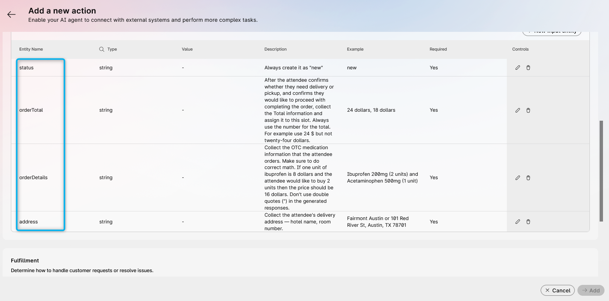

12. Scroll down and for the **Fulfillment** option select **Manage in the source flow (voice only). Click **Save**
   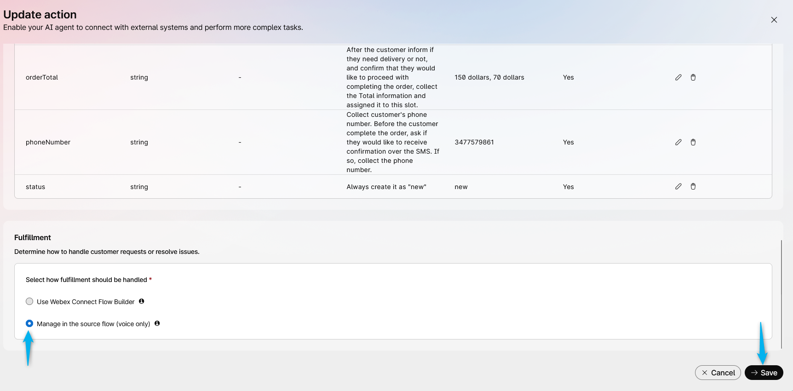

13. **Publish** your AI Agent.
   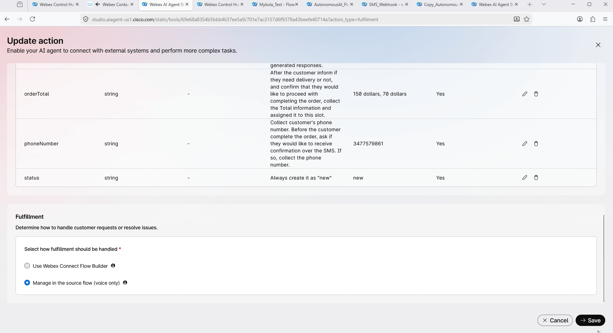

### Task 3. Configure fulfillment logic in the Voice flow.

1. In **Control Hub** go to Flows and open your flow with name **<copy>AutonomousAI_Flow_21209_<w class="attendee"></w></copy>**. Click on **Edit**.
   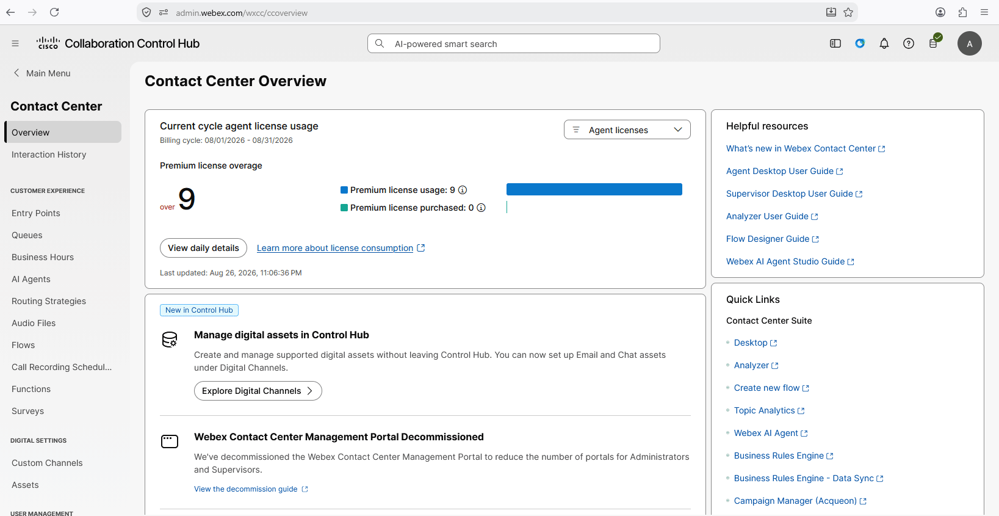

2. Remove **DisconnectContact** node.
   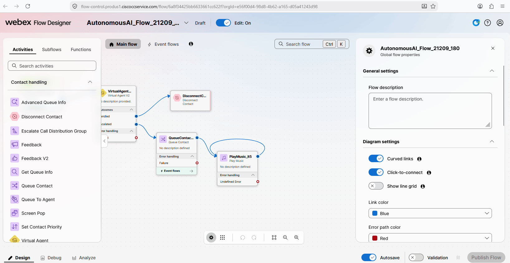

3. Create flow string variable with name **<copy>event_name</copy>** and empty default value.
   

4. Create flow string variable with name **<copy>order_request_details</copy>** and empty default value.
   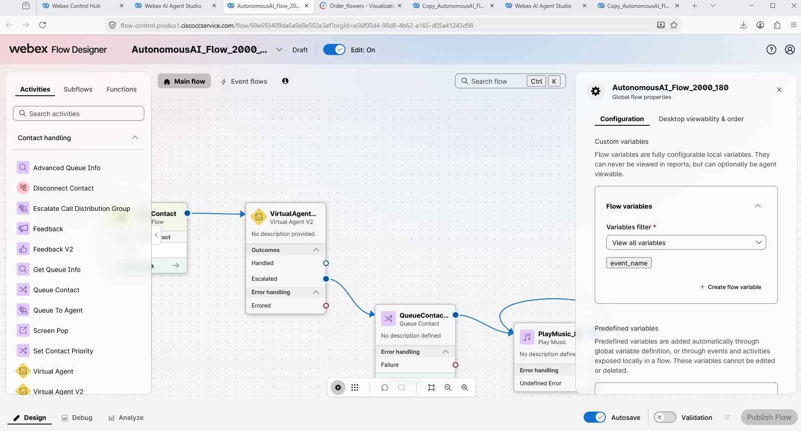

5. Add **SetVariable** node from the left side of flow designer to the field. Connect **VirtualAgentV2** node to the **SetVariable** node.
   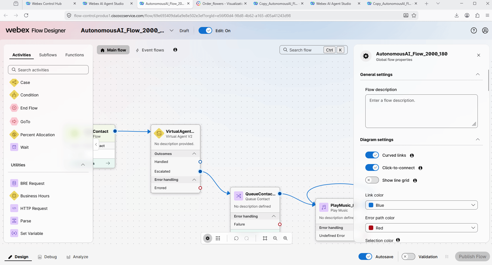

6. Click on the **SetVariable** that you just created and configure your **event_name** variable to be assigned with **VirtualAgentV2....StateEventName** variable.  
   **Note:** *This event name will be the same as your Action name from the AI Agent Studio that is used for the fulfillment.*
   

7. Add one more **SetVariable** node and connect them in series.
   

8. We will need to assign the metadata from AI agent to the **order_request_details** string variable. To do so click on **VirtualAgentV2** node, on the right side scroll down until you will see Activity output variable. Copy the name of the variable related to MetaData. Go to your second SetVariable node and configure **order_request_details** with value of the Metadata that you copy inside of the {{}}. See the gif below.
   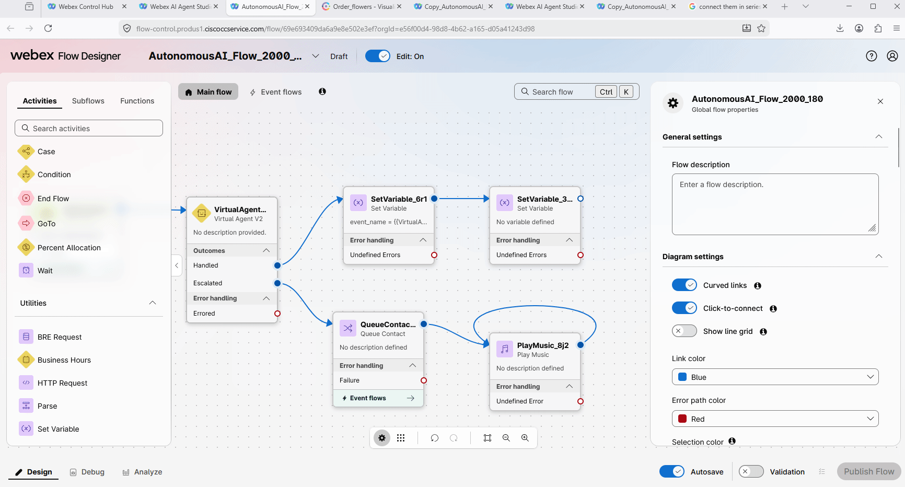

9. Add **Case** node and connect **SetVariable** node to the **Case** node.
   

10. Add **Disconnect Contact** and assign the **Default** output on **Case** node to the **Disconnect Contact**
   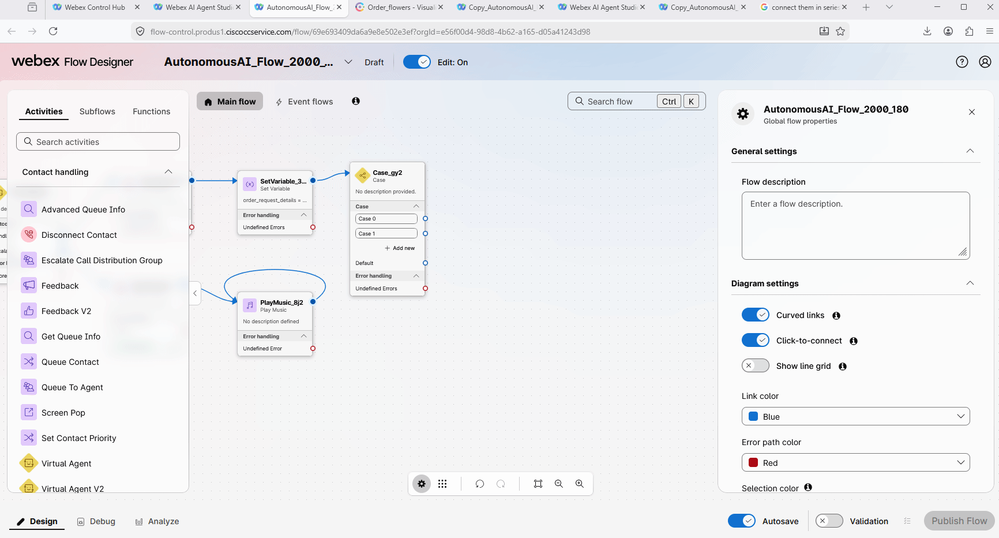

11. Click on **Case** node. Select **event_name** as the Case Variable. Remove the second Link Description. Keep only one Link Description, as for now you have only one action for fulfillment. In the Link Description provide the name of your action: **<copy>Create_Medication_Order</copy>**.
   **Note:** *If you add more actions later, the Case node is used as the distribution logic for different fulfillment requests.*
   

12. Add **HTTP Request** node and connect the **Case** output link to the **HTTP Request** node.
   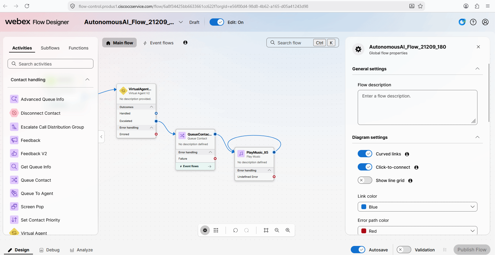

13. Configure the **HTTP Request** with the following:

    - Use authenticated endpoint: **Off**
    - Request URL: **<copy>https://67e9aa0bbdcaa2b7f5b9ed62.mockapi.io/customerOrder</copy>**
    - Method: **POST**
    - Content type: **Application/JSON**
    - Request body: **<copy>{{order_request_details}}</copy>**
       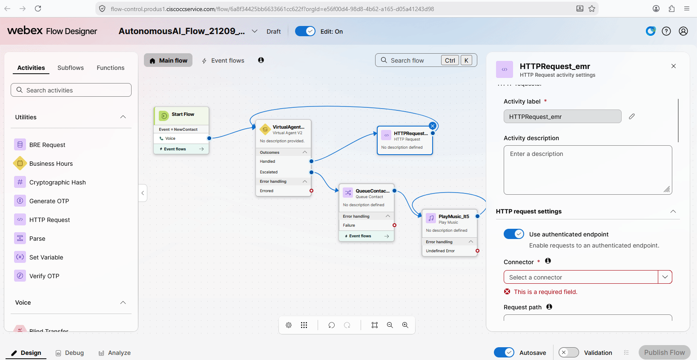

14. Connect **HTTP Request** node to **VirtualAgentV2** node.
   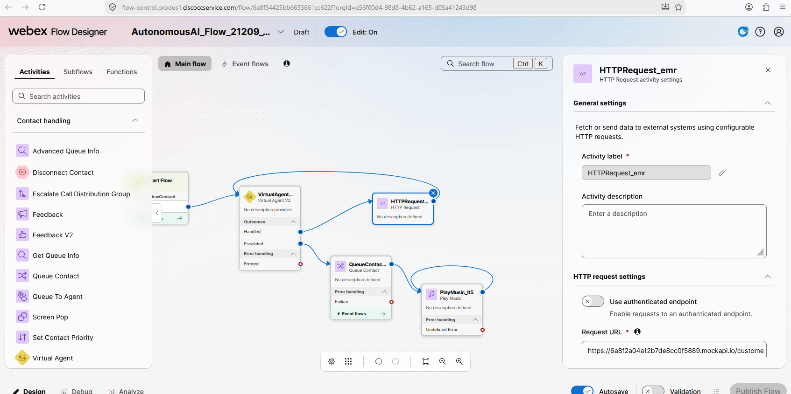

15. Click on **VirtualAgentV2** node, open **State Event** and configure the **Event Name** as **<copy>{{event_name}}</copy>**. In this case when the interaction returns to the AI agent it stays in the same session and AI agent continue the conversation accordingly.
   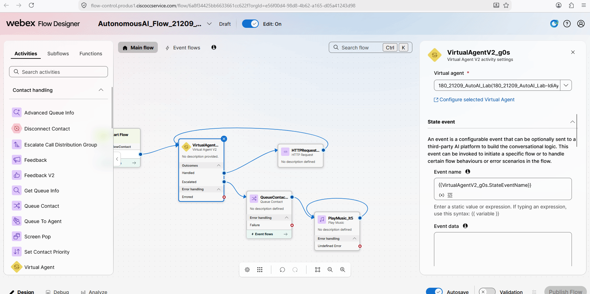

16. Next you need to bring the API call results back to your AI agent. For this, click on the **HTTP Request** node, scroll down on the right side and copy the name of the HTTPRequest...ResponseBody. Then go to **VirtualAgentV2** node, open the **State Events** insert the Http body response to the **Event Data** inside of the {{}}. See the steps on the gif below.
   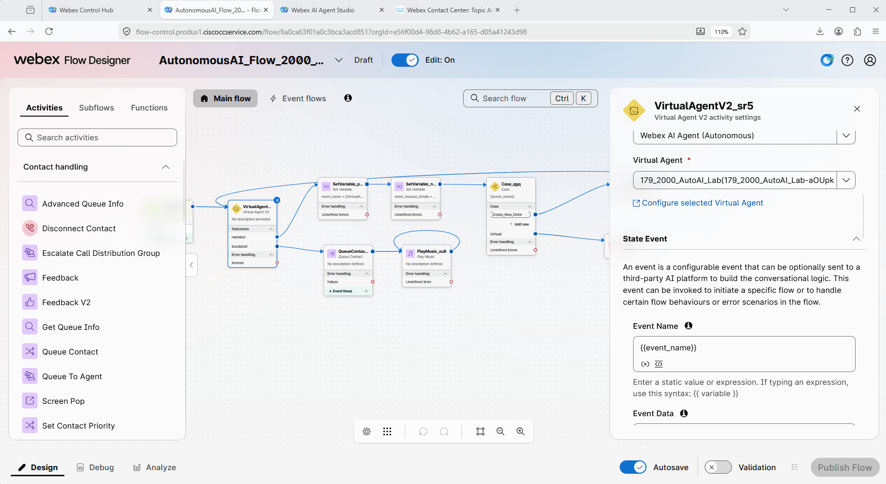

17. Enable decryption in the flow so you can monitor your further test calls details.
   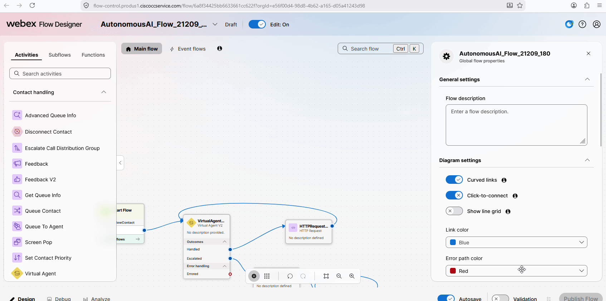

18. **Validate** and **Publish** the flow with the **Latest** tag.
   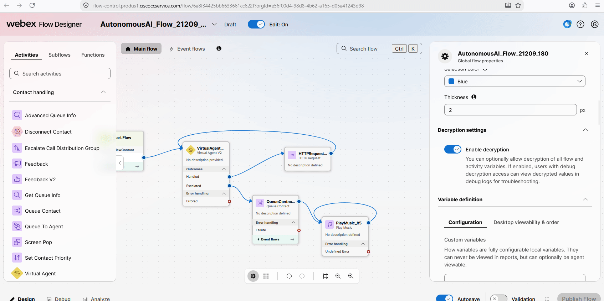

19. Place test call to your test number. Ask to order OTC medication, provide the requested information. You should hear that the order was completed successfully. Trace the call in the voice flow to make sure HTTP request was successful. Click on HTTP Request node, decrypt the results to make sure you got 201 status result.
   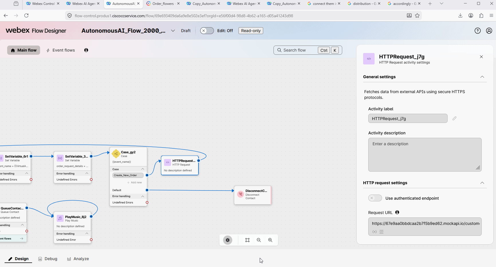

### Task 4. Report the order details to Analyzer.

1. Add Global Variable with name <copy>**Medication_order_details**</copy> to the flow.
   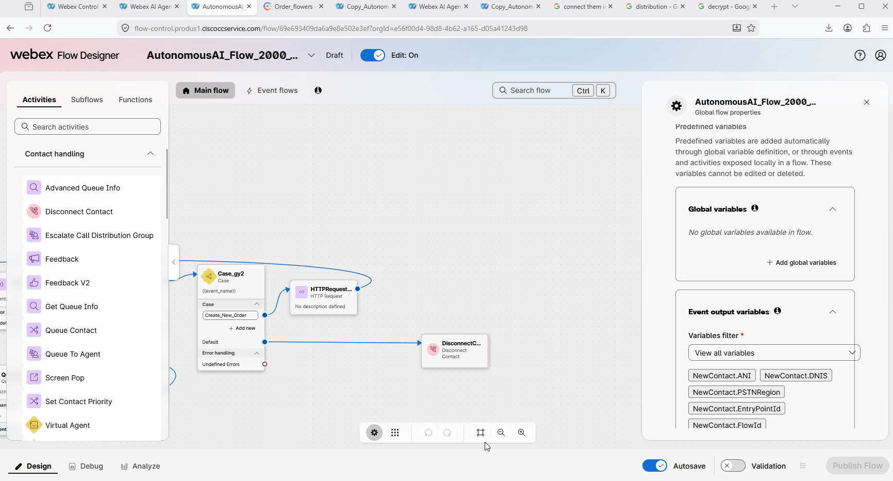

2. Add **SetVariable** node and connect it between **HTTP Request** node and **VirtualAgentV2** nodes.
   

3. Click on **Http Request** node. On the right side scroll down to the Activity output variables, and copy the name that is related to Response Body. Then go to the **SetVariable** block and configure it with Variable **Medication_order_details** and the value that you copied from HTTP Request node inside of the {{}}. See the gif below.
   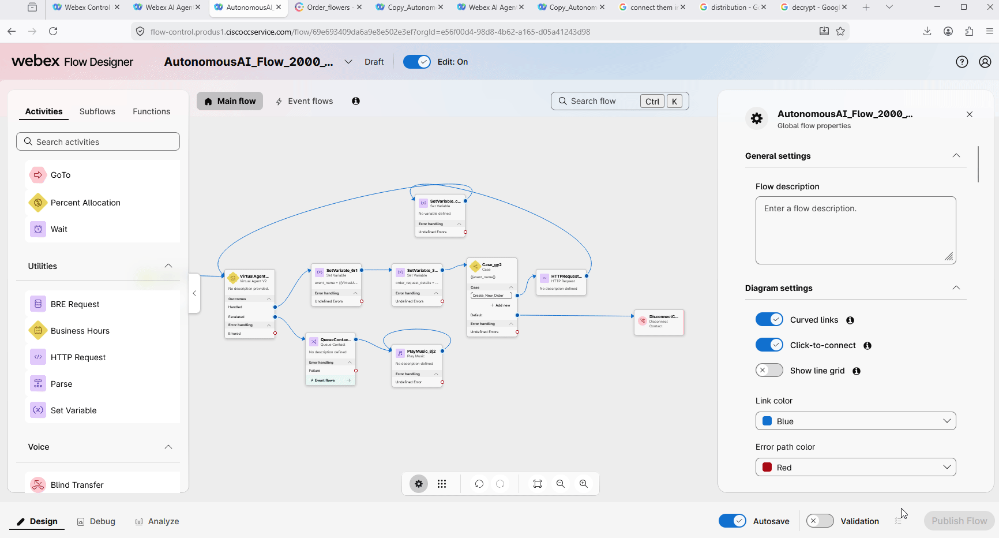

4. Validate and publish the flow.
   

5. Place one more test call and order OTC medication.

6. Open the prebuilt [Analyzer Report](https://analyzer-v2.wxcc-us1.cisco.com/analyzer/view/visualization?tId=e56f00d4-98d8-4b62-a165-d05a41243d98&rId=303296){:target="_blank"}. You might need to enter your admin login credentials. Once logged in, you should see your call in the list.
   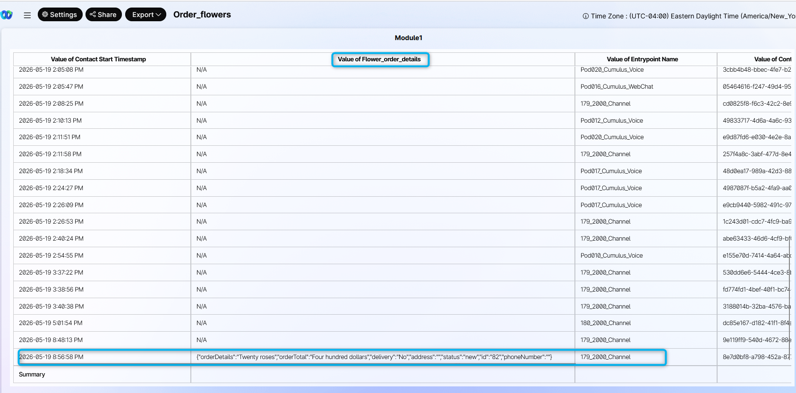

### Task 5. Configure SMS Confirmation.

1. In the flow add one more **HTTP Request** node and connect it between **SetVariable** node and **VirtualAgentV2** nodes.
   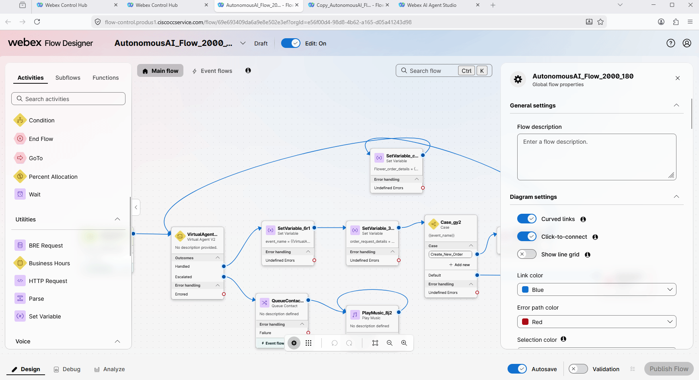

2. Configure the **HTTP Request** with the following:
    - Use authenticated endpoint: **Off**
    - Request URL: **<copy>https://hooks.us.webexconnect.io/events/93VKZM1N24</copy>**
    - Method: **POST**
    - Content type: **Application/JSON**
    - Request body: Body output variable from HTTP request node that you use to create order. The same one that you was using for **SetVariable** node to post the data to Analyzer. See the gif below. **Put it inside of {{}}**.
       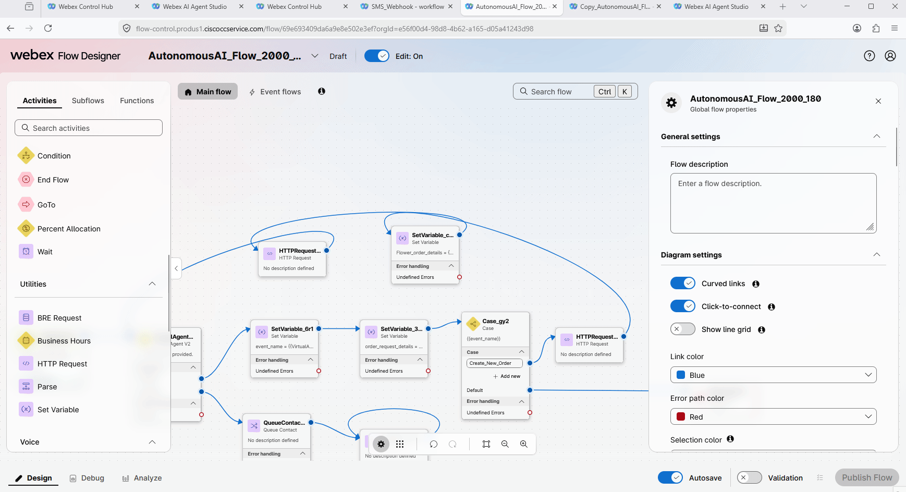

3. Validate and Publish the flow.
       

4. Place test call, create a medication order with a number for SMS confirmation and you should receive the SMS.

       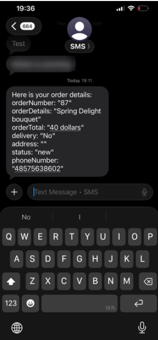

### Task 6. (<strong>Read Only</strong>). Understand SMS configuration.

We have preconfigured the SMS flow in this lab that can be triggered using Webhook. To understand the configuration:

1. From **Control Hub**, go to **Contact Center** > **Overview** > **Webex Connect**.
       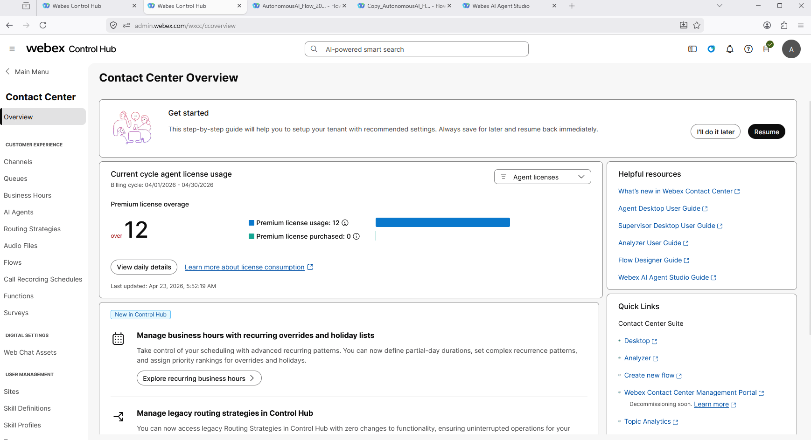

2. Open up Service **<copy>180_21209_Service_</copy>** > **Flows**. This is lab proctor Service where Webhook was configured to trigger the SMS.
       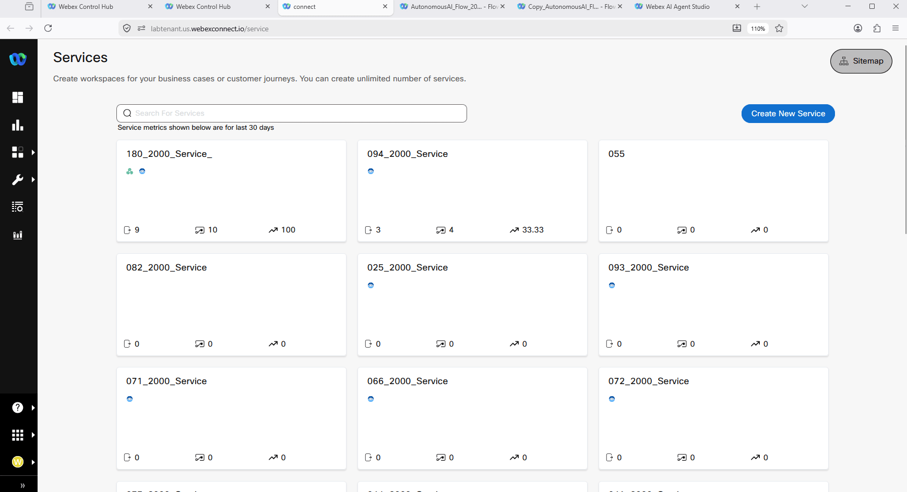

3. Open the Flow **SMS_Webhook**. Please don't do any changes as everybody in this lab are using this flow. This Task is read only, no configurations are needed.
       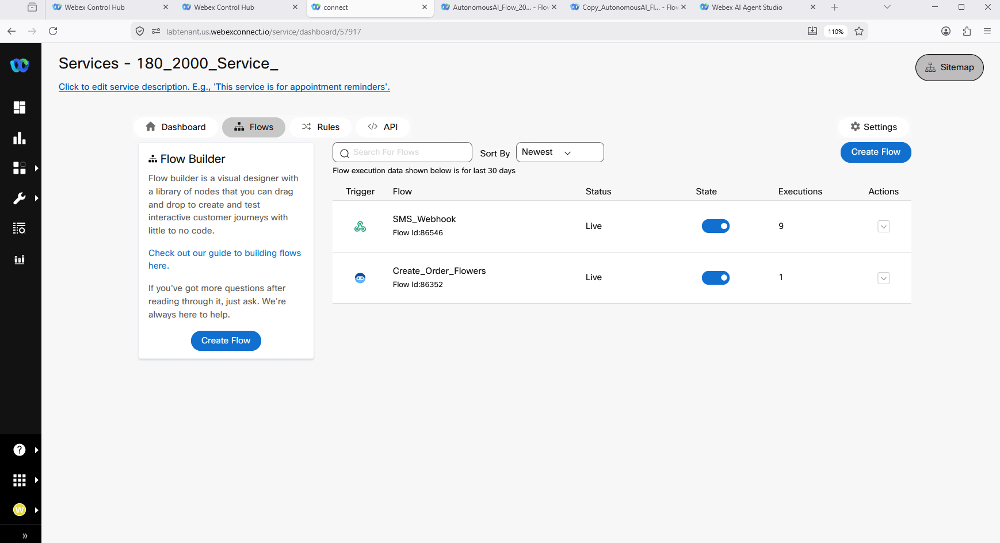

4. Double click on **Configure Webhook** node. You can see the Webhook URL that we configured in our voice flow and the variables that we are expecting in the body request.
       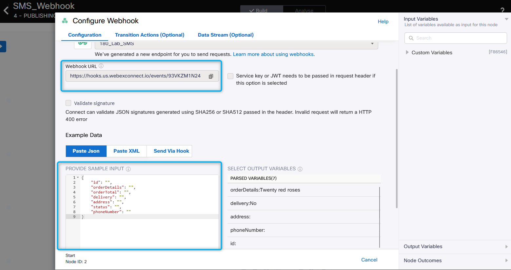

5. Double click on **SMS** node. You will see that the number is carried on from **Webhook** as well as other variables in the **Message** section. The **From Number** 12066478712 is the PSTN provisioned number for SMS.
       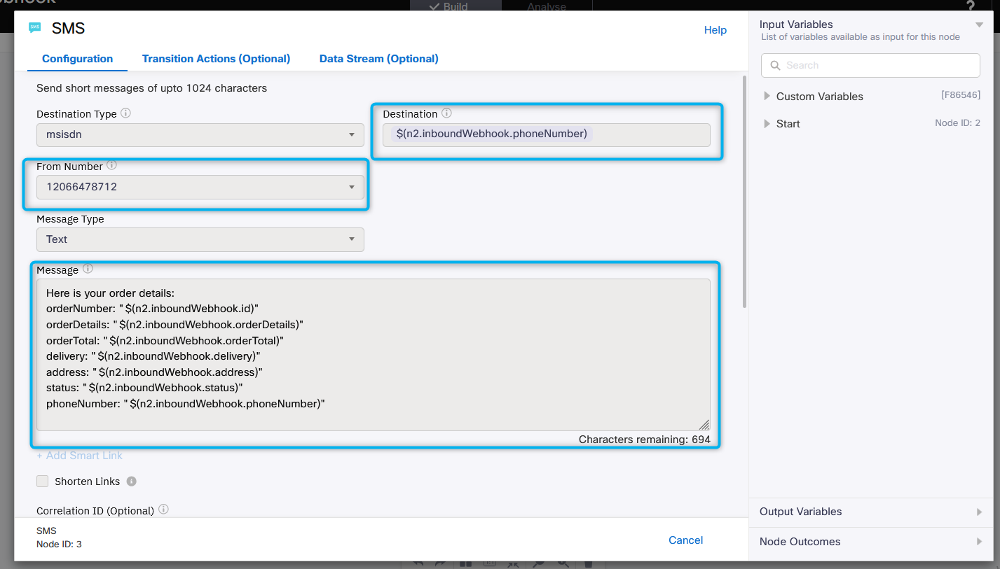

<strong>Congratulations, you have officially completed this mission! 🎉🎉 </strong>

