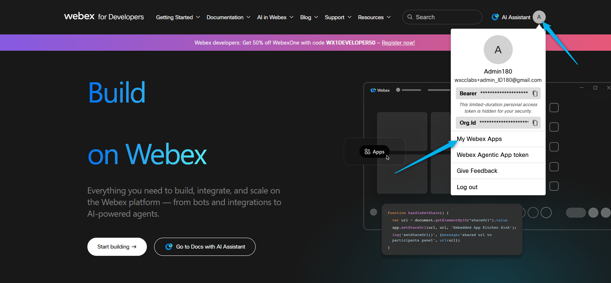
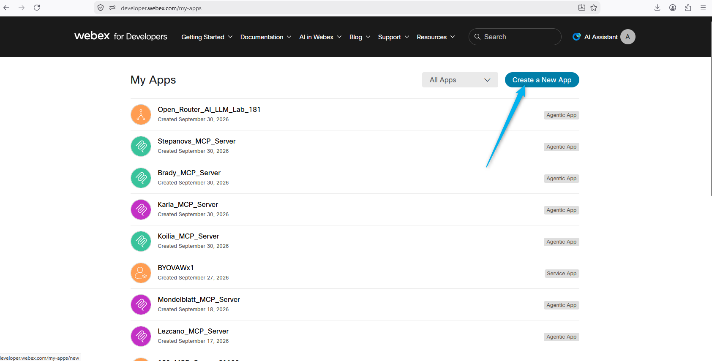
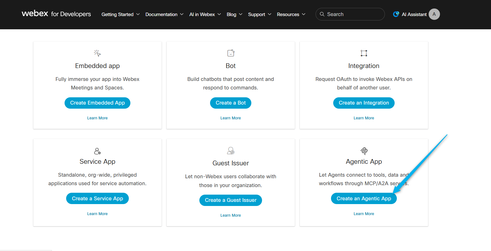
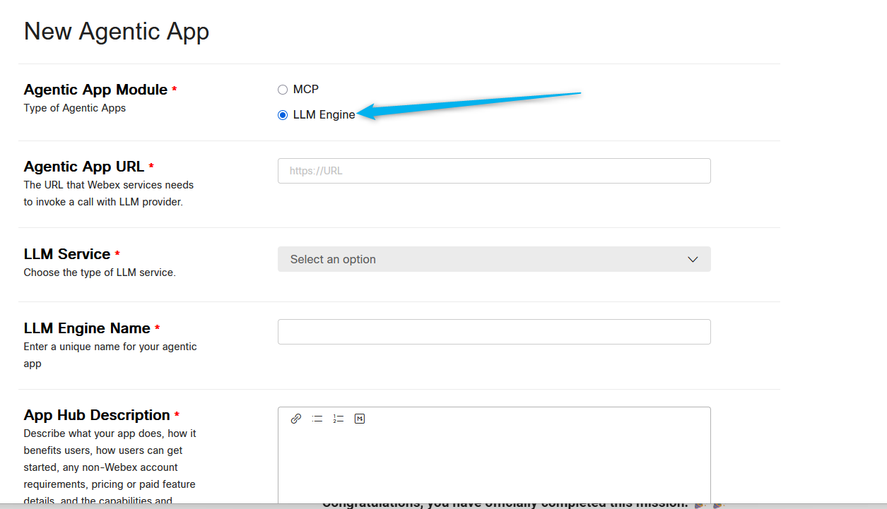
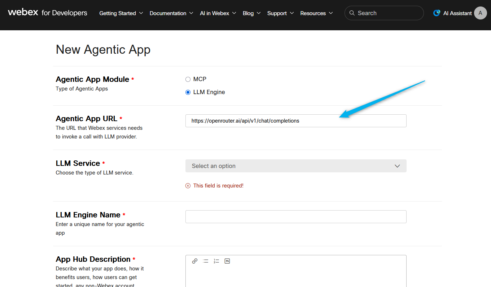
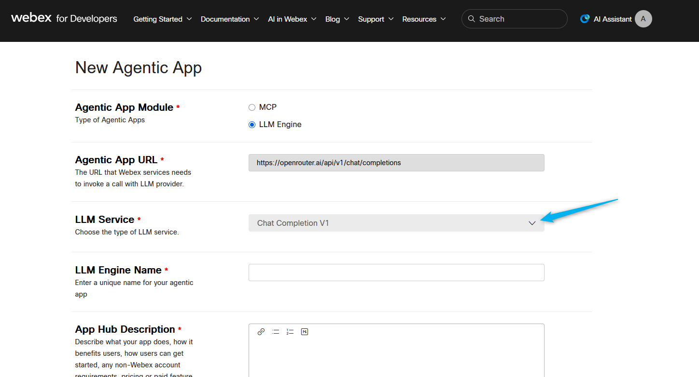
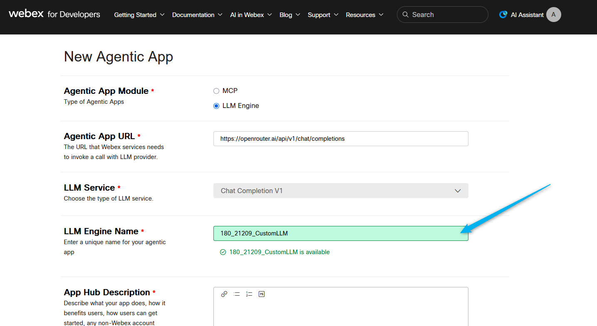
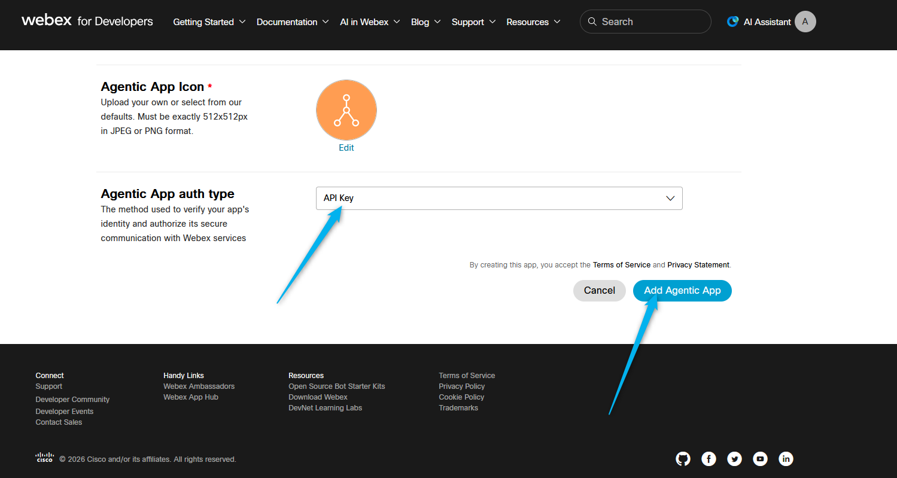

# Mission 2: Register the LLM as an Agentic App

**<details><summary>What is an Agentic App? <span style="color: orange;"></span></summary>**

An Agentic App registers an external capability — in this case your own LLM — in the Webex ecosystem so administrators can approve it, configure authentication, and use it with Webex AI Agent.

## </details>

## Mission overview

Your mission is to:

**Register your LLM as an agentic app** in the **Webex Developer Portal**. This agentic app represents the preconfigured **OpenRouter GPT6-Luna** gateway from Mission 1.

---

## Build

### Task 1. Create an Agentic App in the Webex Developer Portal

1. Open the [Webex Developer Portal](https://developer.webex.com/){:target="_blank"}.

2. Click **Login**. Sign in with your admin credentials.


3. Under the profile menu, click **My Webex Apps**.


4. Click **Create a New App**.


5. On the next page, select **Create an Agentic App**.


6. Under **Agentic App Module**, select **LLM Engine**.


7. Enter the OpenRouter base URL that you found in Mission 1: **<copy>https://openrouter.ai/api/v1/chat/completions</copy>**


8. For the LLM Service, select **Chat Completion V1**.


9. Name your app **<copy><w class="attendee"></w>\_21209_CustomLLM</copy>**.


10. For **Agent App Description**, paste the text below (use the **copy** icon on the code block):

    ``` text
    Custom LLM for Webex Event Health. This agentic app exposes an external Large Language Model that will be used as a Custom AI Engine for the Event Health autonomous AI agent.
    ```

11. Select an available Agentic App icon.


12. For **Agentic App auth type**, select **API key**, then click **Add Agentic App**.


<p style="text-align:center"><strong>Congratulations, you have officially completed this mission! 🎉🎉 </strong></p>
