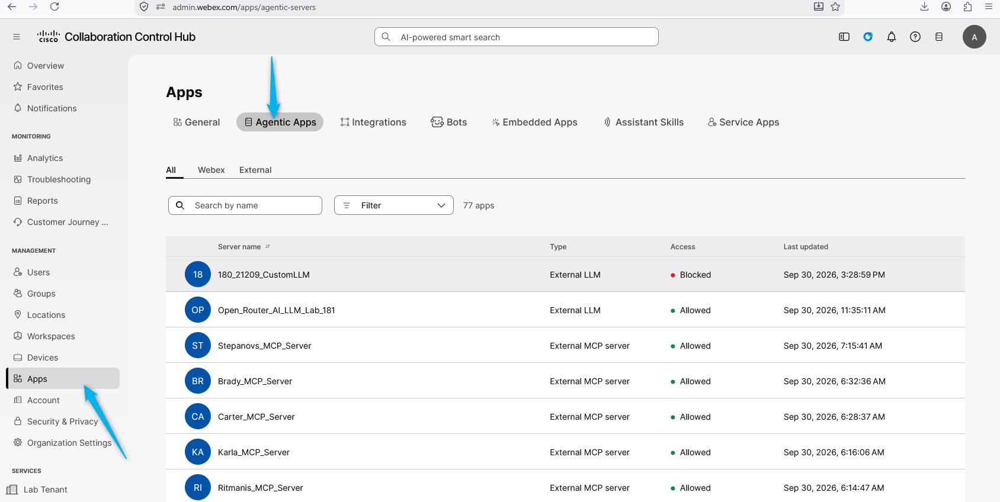
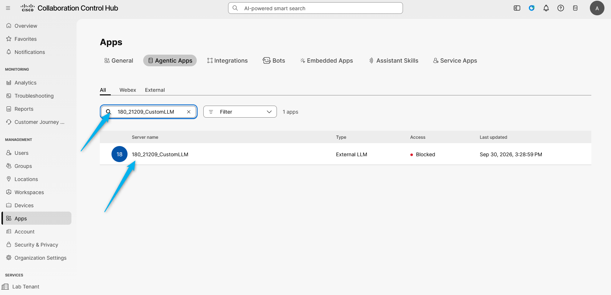
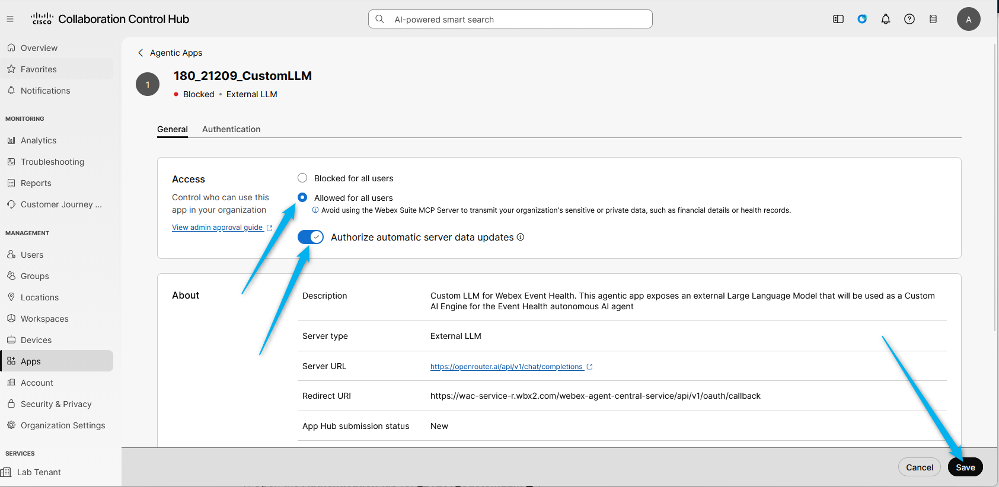
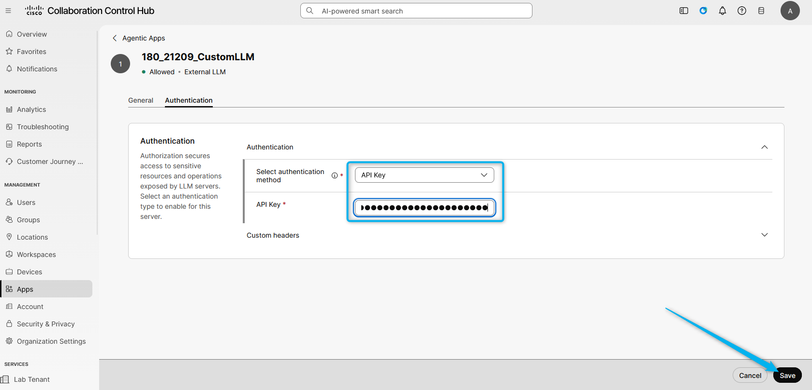

# Mission 3: Configure Authentication in Control Hub

## Mission overview

Your mission is to:

**Configure authentication for the agentic app** in **Control Hub**.

---

## Build

### Task 1. Enable the Agentic App

1. Go to [Control Hub](https://admin.webex.com){:target="_blank"}. If you are in Contact Center settings, click **Main Menu** at the top to go to general settings.

2. Open **Apps**, then click **Agentic Apps**.

3. Find the app associated with your ID, **<copy><w class="attendee"></w>\_21209_CustomLLM</copy>**, and open it.

4. Make it **Allowed for all users**, enable **Authorize automatic server data updates**, and click **Save**.

5. Open the **Authentication** tab. Select **API key** as the authentication method and enter the API key you copied from OpenRouter in Mission 1. Click **Save**.

<strong>Congratulations, you have officially completed this mission! 🎉🎉 </strong>

