# Mission 4: Create and Assign the Custom AI Engine

**

What is a Custom AI Engine? 
**

A Custom AI Engine lets Webex AI Agent use your own LLM for reasoning and generation, while Webex continues to manage media, state, orchestration, and channel integration.

## 

## Mission overview

Your mission is to:

**Create the AI Engine in AI Agent Studio**, point it at the agentic app you registered in Mission 2, and **assign it** to your Event Health AI agent. The engine uses the preconfigured **OpenRouter** gateway to reach **GPT6-Luna**.

---

## Build

### Task 1. Create the AI Engine

1. Go to [Control Hub](https://admin.webex.com){:target="_blank"}.

2. Open **Contact Center** from the left navigation, and under **Overview > Quick Links**, click **Webex AI Agent**.

3. In **AI Agent Studio**, open **AI Engines**.
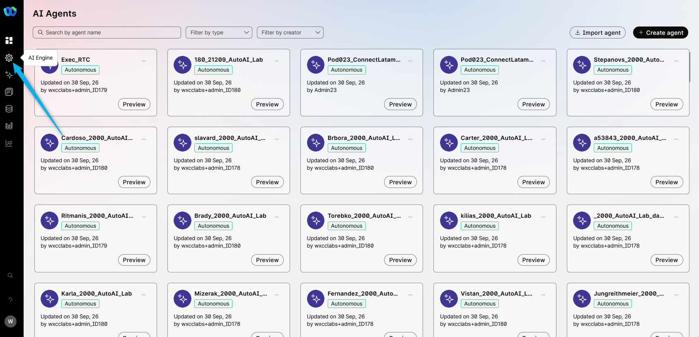

4. Click **Create AI Engine**.
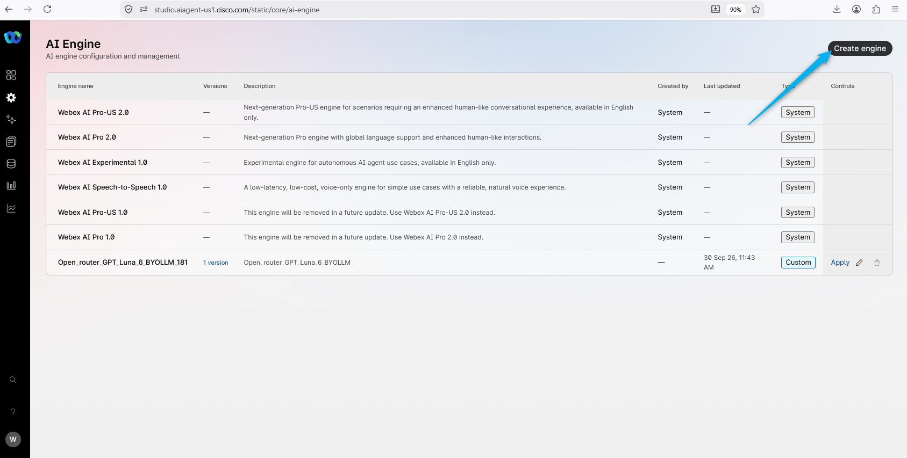

5. Provide the following information, then click **Next**.

    > Engine Name: **<copy><w class="attendee"></w>\_21209_CustomAIEngine</copy>**
    >
    > Description: **<copy>Custom Engine</copy>**
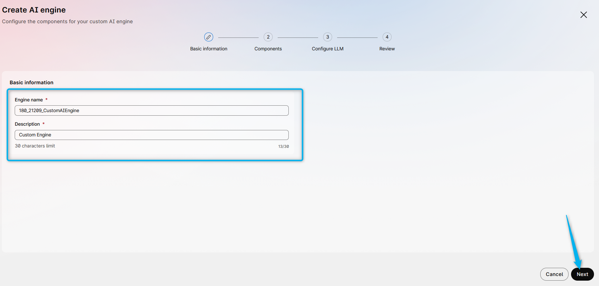

6. Don't make any changes on the next page. Just click **Next**.

7. Select your custom LLM that is related to your ID from the list. Search for **<copy><w class="attendee"></w>\_21209_CustomLLM</copy>**.
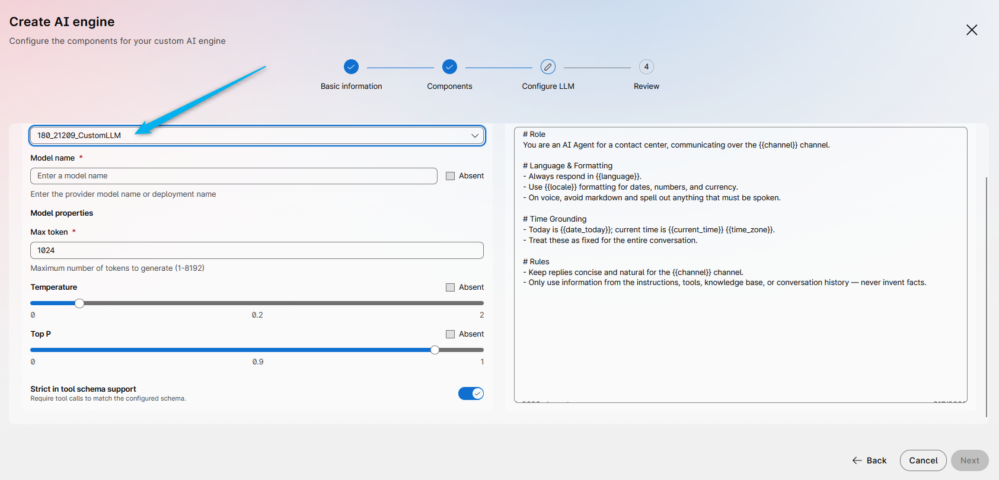

8. In **Model name**, provide the exact LLM name that you saw in OpenRouter. Please review Mission 1, step 8. In this lab it is **<copy>openai/gpt-6-luna</copy>**.
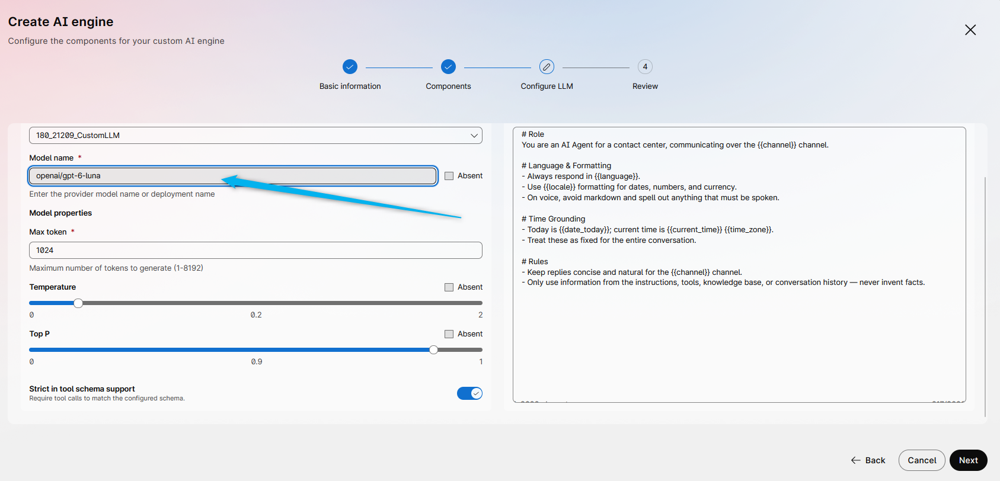

9. Select **Absent** for **Temperature** and **Top P**, because not all third-party models support these features.
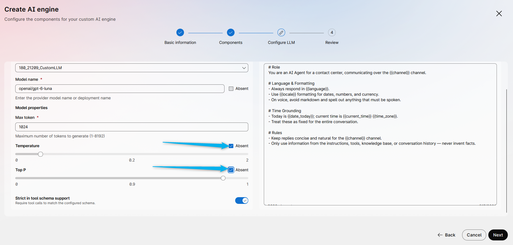

10. Review the prompts for the model. This prompt will be appended to the instructions of your AI agent. You don't need to customize it in this lab, but for your business you can customize it for your needs. Then click **Next**.
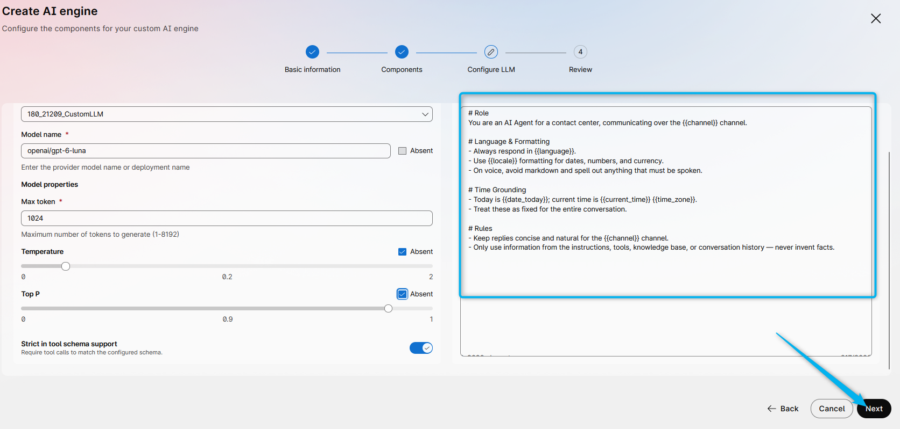

11. On the next page, click **Validate**.
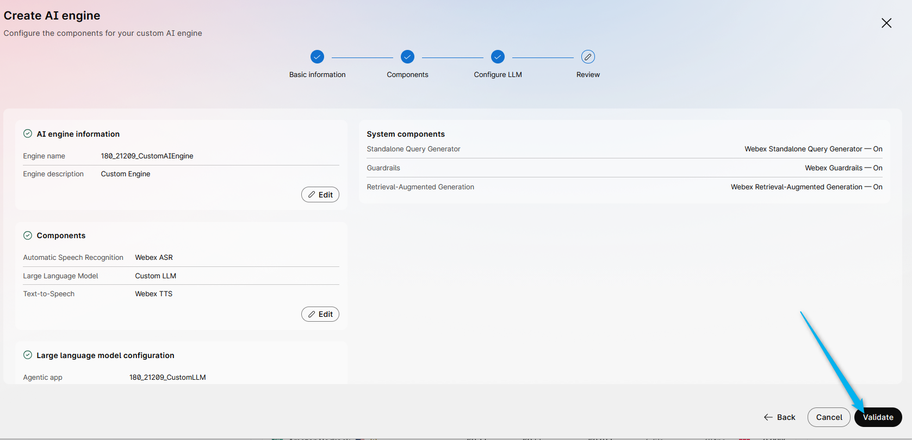

12. After validation is completed, click **Create engine**.
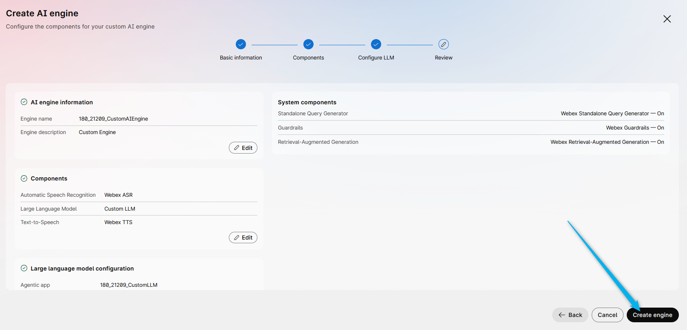

### Task 2. Assign the engine to your existing agent

1. In **AI Agent Studio**, open **AI Agents**.

2. Select the agent **<copy><w class="attendee"></w>\_21209_AutoAI_Lab</copy>**.
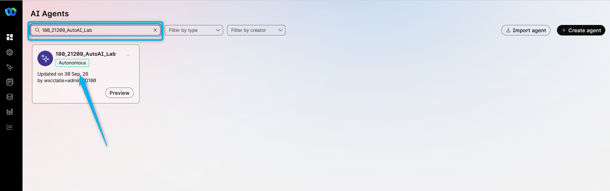

3. In the agent profile, change **AI engine** from **Webex AI Pro-US 2.0** to **<copy><w class="attendee"></w>\_21209_CustomAIEngine</copy>**.
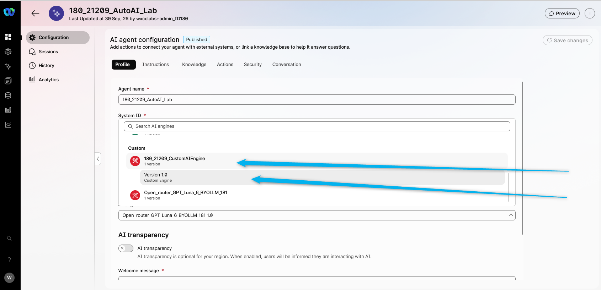

4. Click **Save changes**.
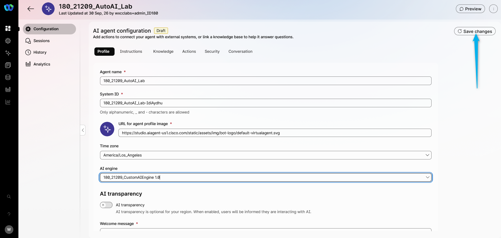

5. **Publish** the AI agent. Provide a version name (for example, **V2-BYOLLM**).
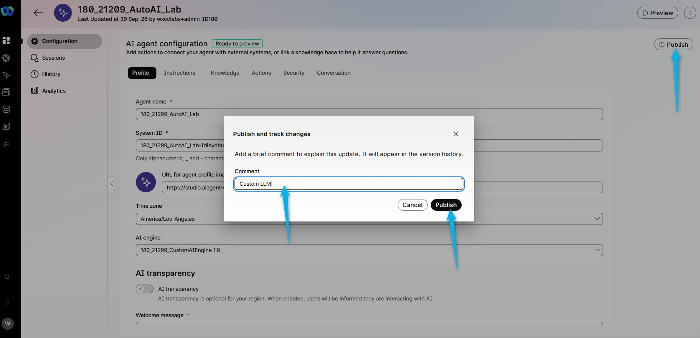

### Task 3. Test the Custom AI Engine

1. Click **Preview** and start a chat.

2. Send **<copy>I have a headache and need some help</copy>**. Confirm that the agent still answers using your Event Health knowledge and that responses are now driven by your Custom AI Engine.
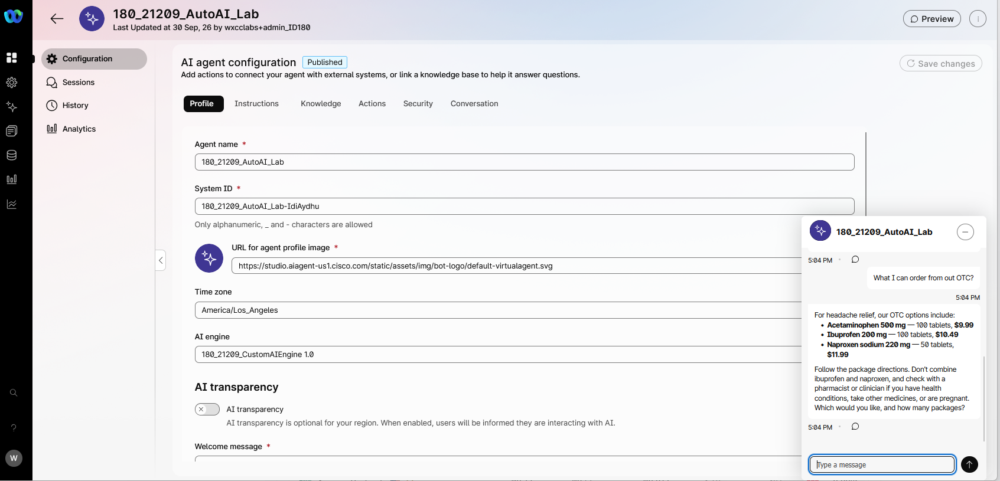

3. Call the phone number that is related to your Entry Point. Talk to the AI agent and try to order OTC medication with delivery. It uses the same AI Agent configuration, but a different LLM for chat completion on the backend. 

<strong>Congratulations, you have officially completed this mission! 🎉🎉 </strong>

