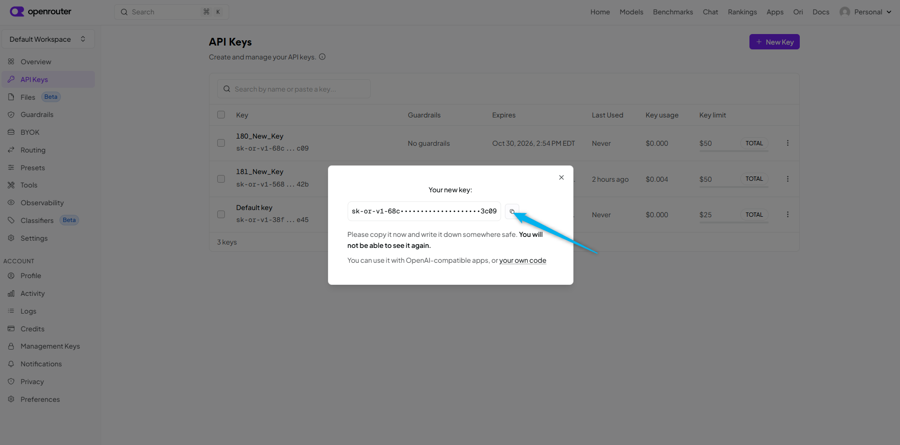
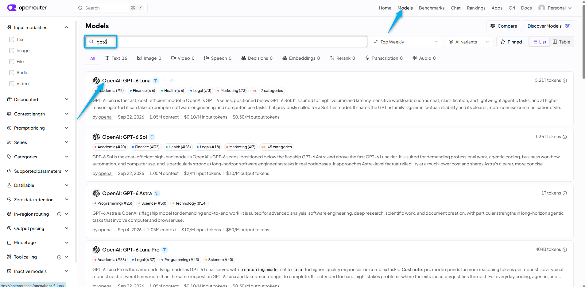
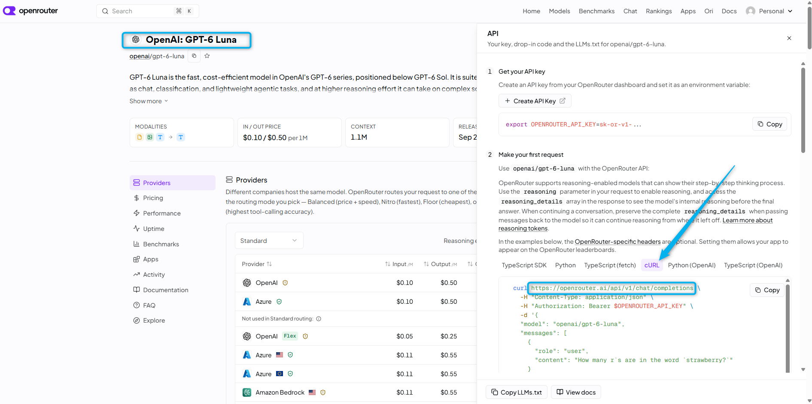
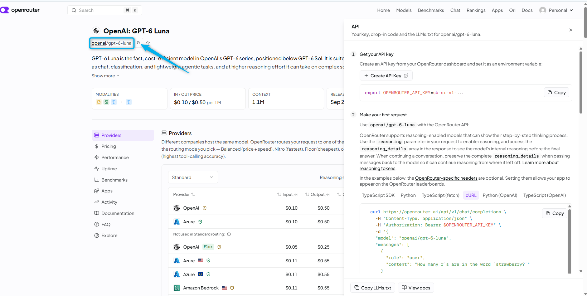

# Mission 1: Review OpenRouter API Gateway [Read Only]

**

What is OpenRouter? 
**

OpenRouter is a unified API gateway and marketplace that lets you access over 500 different artificial intelligence models—including from providers like OpenAI, Anthropic, and Google—using a single API key and billing account. It provides a single OpenAI-compatible endpoint to many AI models, including GPT models. In this lab, OpenRouter sits between Webex AI Agent and **GPT6-Luna** so the Custom AI Engine can call the LLM without each attendee managing a model-provider account.

## 

## Mission overview

**[Read Only]** This mission is for review only.

This lab uses **OpenRouter** as the API gateway to the AI models. The gateway is already preconfigured for **GPT6-Luna**.

For this lab, the instructor uses a **personal OpenRouter account** with **personal billing details**, so access to this specific OpenRouter tenant cannot be shared. In this mission, you will see exactly what was done to get the API details for the Webex integration. After the lab, you can easily create your **own OpenRouter account** and API key for the same integration.

---

## Preconfigured setup

### Task 1. Review the OpenRouter gateway configuration

1. Open [OpenRouter](https://openrouter.ai/){:target="_blank"}. Log in, or create an account to log in.

2. You will be prompted to add billing details. Add your billing card and buy some credits.

3. Click **API Key** and create a new **API key**.

4. Fill in the required fields and click **Create**.

5. Copy the API key. You will need it for authentication with Webex.

6. Click **Models**. Search for the model that you want to use with your Webex AI Agent. For this lab we will be using **GPT6-Luna**, because this model is fast, capable, and inexpensive. For your own use cases, you can select faster models that will give you a better customer experience.

7. If you select the model and click **API > cURL**, you will see the base URL for the OpenRouter completions service. You will use this URL in the next mission while creating the agentic app in the Webex Developer Portal.

8. In addition to the base URL for the completions service, you also need the URL suffix that is specific to this model. You can find it on the same page, right after the model name. See the screenshot. You will use this URL extension in Mission 4 when you create the Custom AI Engine.

<strong>You have reviewed the OpenRouter setup. Continue to Mission 2.</strong>

