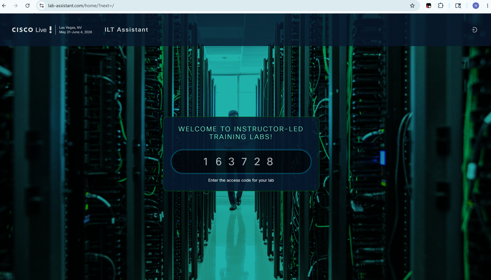
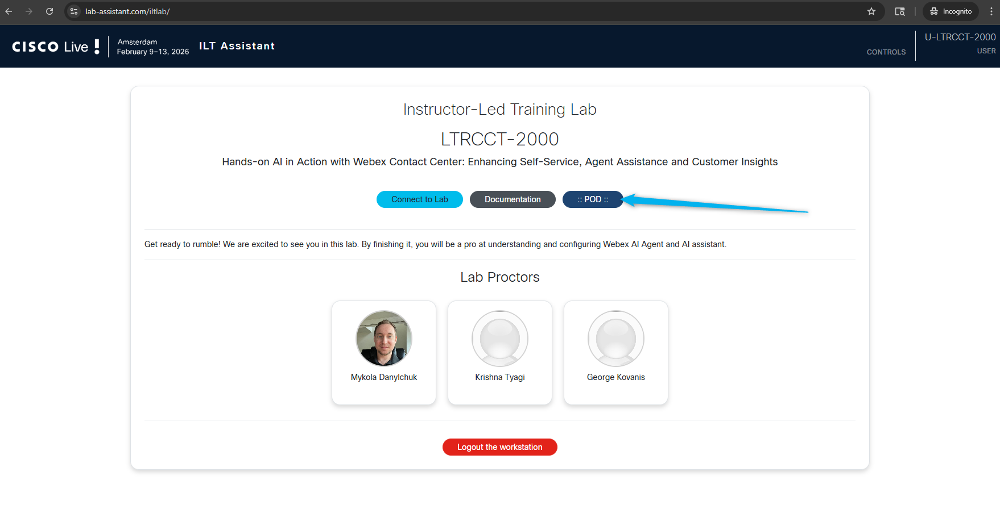
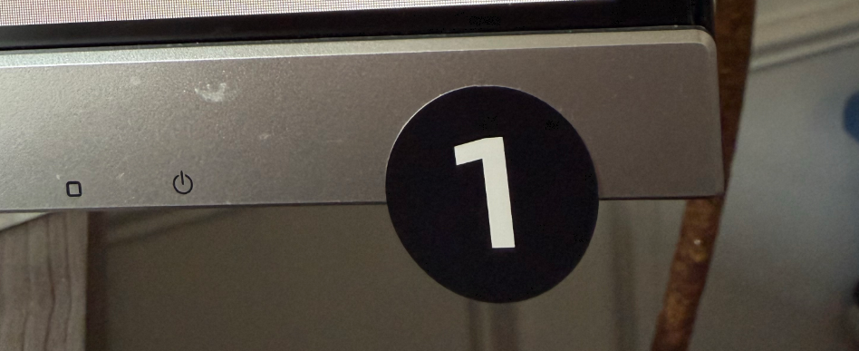
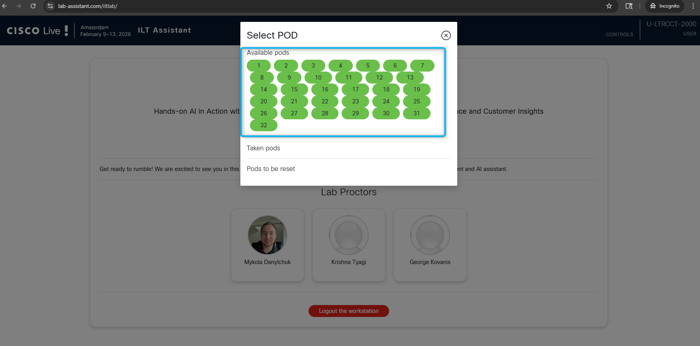
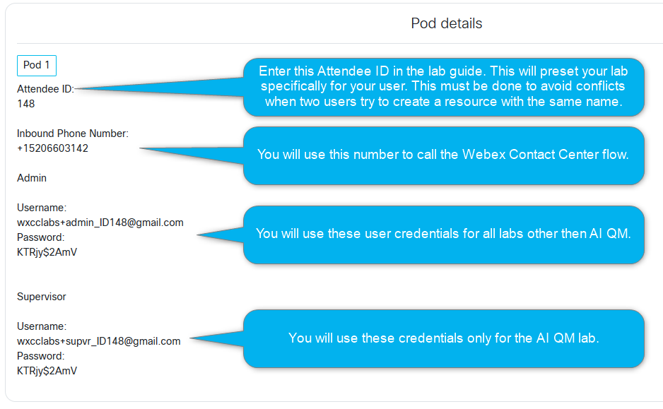

## Get your login credentials

1. In the Chrome browser open the lab access page **<copy>https://lab-assistant.com</copy>**

2. Enter the access code **<copy>163728</copy>** and press **Enter**.
   

3. Navigate to the **POD** section.
   

4. Look at the bottom of your right screen; you will see tag with your pod number.
   

5. Select the pod that is associated with the number tag attached to your screen.
   

6. Use this Attendee ID and login details to follow the lab. You can copy and paste login credentials and other details into a notepad if this would be convenient for you.

   

<!-- Markdown content with embedded HTML -->

    <h3><b>Please submit the Attendee ID below.</b></h3> 
    <h3>All configuration entries in the lab guide will be renamed to include your Attendee ID.</h3>
    <form id="info">
        <label for="attendee">Attendee ID:</label>
        <input type="text" id="attendee" name="attendee" placeholder="Enter 3 digits" required>
        <button onclick="setValues()">Save</button>
    </form>

     

    
Your stored Attendee ID is:<w class="attendee"> No ID stored</w>

## Overview of the Use Case

You are designing a **Webex AI Agent** for **Webex Event Health** — an AI-powered health assistance service for Cisco and Webex event attendees who are traveling and away from their regular healthcare providers.

Attendees can call a Webex AI Agent whenever they feel unwell or need healthcare assistance while attending an event.

[Webex AI Agent use case example](https://blog.webex.com/customer-experience/announcing-general-availability-of-webex-ai-agent-paving-way-new-era-cx/){:target="_blank"}

### Business Problem

While traveling to an event, attendees may:

- Feel sick and not know where to get care
- Be far from their family doctor
- Need a nearby doctor or clinic
- Need OTC medication
- Need medication delivered to their hotel

### Solution

The Webex AI Agent becomes a single point of contact through a voice call:

**Attendee → Voice Call → Webex AI Agent → Healthcare Services**

### AI Agent Capabilities

- **Collect basic information** about the attendee's health needs and symptoms
- **Identify when the call should be escalated** to a healthcare professional based on predefined rules
- **Connect the attendee with their family doctor** when available
- **Find a partner clinic** and schedule an appointment
- **Find and order eligible OTC medication** from the pharmacy catalog
- **Arrange pharmacy pickup or hotel delivery**
- **Support insurance or self-pay options**
- **Transfer the caller to a healthcare professional** when needed for complex cases

## Learning Objectives

Welcome to **"Build Webex AI Agents with Your Own Custom LLM - LAB-21209"**

In this lab, participants will:   
**• Build an Autonomous AI Agent:** Create and configure a Webex Autonomous AI Agent tailored for event health assistance using your own knowledge base and custom LLM instructions.   
**• Integrate Intelligent AI Agents:** Utilize Cisco Autonomous AI Agent to build dynamic, context-aware self-service flows that adapt to attendee health needs in real time.   
**• Configure Fulfillment Actions:** Connect the AI Agent to external systems to create medication orders, send confirmations, and complete healthcare service requests.   
**• Extend with MCP:** Integrate Model Context Protocol (MCP) tools to look up pharmacy locations and check order status without rebuilding logic in every flow.   
**• Seamless AI-to-Human Collaboration:** Experience smooth transitions from AI agents to healthcare professionals, ensuring continuous context for effective issue resolution.

## Disclaimer

The lab design and configuration examples provided are for educational purposes. For production design queries, please consult your Cisco representative or an authorized Cisco partner.

Let's get started and discover how **Webex AI Agent** delivers intelligent health assistance for event attendees!
