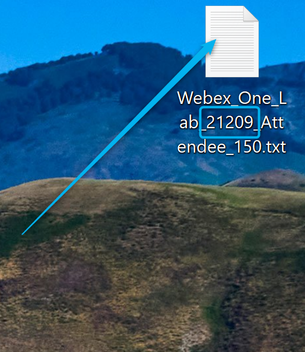
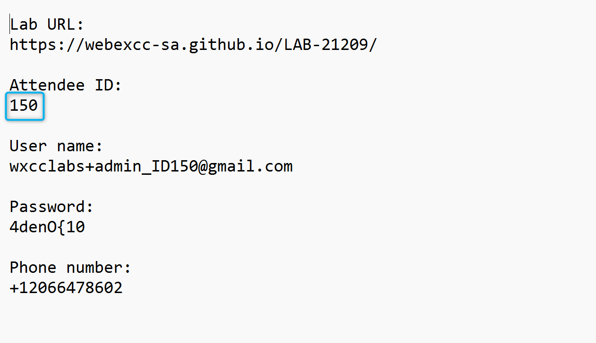

## Get your login credentials

On your screen, look for the file named **Webex_One_AI_Attendee_(ID)**. Open the file. 
    

Open the file; you should see the following information related to your ID.
   

As the next step, you need to set up your lab for your Attendee ID. In this case, you will all do configuration on the same tenant without interrupting other users.

<!-- Markdown content with embedded HTML -->

    <h3><b>Please submit the Attendee ID below.</b></h3>
    
All configuration entries in the lab guide will be renamed to include your Attendee ID.

    <form id="info">
        <label for="attendee">Attendee ID:</label>
        <input type="text" id="attendee" name="attendee" placeholder="Enter 3 digits" maxlength="3" required>
        <button type="button" onclick="setValues()">Save</button>
    </form>
    
Your stored Attendee ID is: <w class="attendee">No ID stored</w>

## How this lab is structured

This lab has two parts. You will use the **same Autonomous AI Agent** in both.

1. **Configure Autonomous AI Agent** — Create the Webex Autonomous AI Agent using the **built-in standard engine**.
2. **Bring Your Own LLM** — Integrate a **custom engine** and plug it into the Autonomous AI Agent you created.

The agent, instructions, knowledge, and actions stay in place. The difference is in the background: each part uses a **different LLM**.

## Overview of the Use Case

You are designing a **Webex AI Agent** for **Webex Event Health** — an AI-powered health assistance service for Cisco and Webex event attendees who are traveling and away from their regular healthcare providers.

Attendees can call a Webex AI Agent whenever they feel unwell or need healthcare assistance while attending an event.

### Business Problem

While traveling to an event, attendees may:

- Feel sick and not know where to get care
- Be far from their family doctor
- Need a nearby doctor or clinic
- Need OTC medication
- Need medication delivered to their hotel

### Solution

The Webex AI Agent becomes a single point of contact through a voice call:

**Caller → Voice Call → Webex AI Agent → Healthcare Services**

## Disclaimer

The lab design and configuration examples provided are for educational purposes. For production design queries, please consult your Cisco representative or an authorized Cisco partner.

Let's get started and discover how **Webex AI Agent** delivers intelligent health assistance for event attendees!
